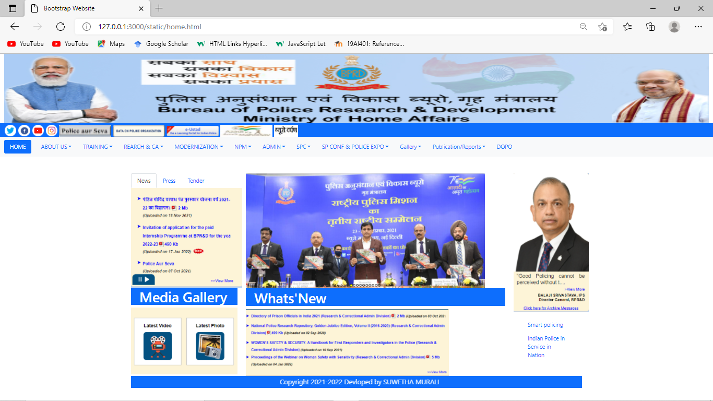
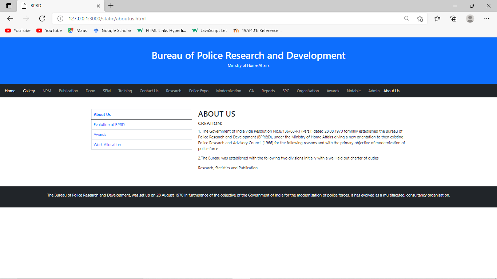

# Web Design using Bootstrap Framework

## AIM:
To design a website using bootstrap framework.

## DESIGN STEPS:

### Step 1:

Requirement collection.

### Step 2:

Creating the layout using bootstrap grid system.

### Step 3:

Updating the sample content.

### Step 4:

Choose the appropriate style and color scheme.

### Step 5:

Validate the layout in various browsers.

### Step 6:

Validate the HTML code.

### Step 6:

Publish the website in the given URL.

## PROGRAM :
#### HOME PAGE:
```
<!DOCTYPE html>
<html lang="en">
<head>
    <meta charset="UTF-8">
    <meta http-equiv="X-UA-Compatible" content="IE=edge">
    <meta name="viewport" content="width=device-width, initial-scale=1.0">
    <title>Bootstrap Website</title>
    <link href="https://cdn.jsdelivr.net/npm/bootstrap@5.0.2/dist/css/bootstrap.min.css" rel="stylesheet" integrity="sha384-EVSTQN3/azprG1Anm3QDgpJLIm9Nao0Yz1ztcQTwFspd3yD65VohhpuuCOmLASjC" crossorigin="anonymous">
<script src="https://cdn.jsdelivr.net/npm/bootstrap@5.0.2/dist/js/bootstrap.bundle.min.js" integrity="sha384-MrcW6ZMFYlzcLA8Nl+NtUVF0sA7MsXsP1UyJoMp4YLEuNSfAP+JcXn/tWtIaxVXM" crossorigin="anonymous"></script>
</head>
<body>
    <div class='container-fluid'>
        <center>
            
        </center>
    </div>
    <div class="container-fluid pt-1 bg-primary text-white text--left-align">
        <a href="https://twitter.com/ "target="_blank"></a>
        <a href="https://www.facebook.com/ "target="_blank"></a>
        <a href="https://www.youtube.com/ "target="_blank"></a>
        <a href="https://www.instagram.com/ "target="_blank"></a>
        <a href="" target="_blank"></a>
        <a href='' target='_blank'></a>
        <a href="https://eustad.in" target="_blank"> </a>
        <a href=""target="_blank"></a>
        <a href=""target="_blank"></a>
        <!--<a href="class/html-css/navigation/skip-navigation#content"target='blank'></a>
    -->
    </div>    
    <div class='col'>
        <nav class="navbar navbar-expand-sm bg-light navbar-light">
        <div class="nav nav-pills">
            <li class='nav-item' style="padding: 0 12px;">
                <a class="nav-link active" herf="./static/home.html">HOME</a>
            </li>
            <li class="nav-item dropdown">
                <a class="nav-link dropdown-toggle" data-bs-toggle="dropdown" href="aboutus.html">ABOUT US</a>
                <ul class="dropdown-menu">
                    <li><a class="dropdown-item" href="aboutus.html">Evolution of Bprd</a></li>
                    <li><a class="dropdown-item" href="#">Awards/metals</a></li>
                    <li><a class="dropdown-item" href="#">Work Allocation</a></li>
                    <li><a class="dropdown-item" href="#">Organization</a></li>
                    <li><a class="dropdown-item" href="#">Draft Legislation</a></li>
                    <li><a class='dropdown-item' href='#'>Contact US</a></li>
                    <li><a class='dropdown-item' href='#'>Citizens Corner</a></li>  
                </ul>
            </li>
            <li class="nav-item dropdown">
                <a class="nav-link dropdown-toggle" data-bs-toggle="dropdown" href="#">TRAINING</a>
                <ul class="dropdown-menu">
                    <li><a class="dropdown-item" href="#">Domestic courses</a></li>
                    <li><a class="dropdown-item" href="#">foreign courses</a></li>
                    <li><a class="dropdown-item" href="#">Training certificate</a></li>
                    <li><a class="dropdown-item" href="#">Miscellanous</a></li>
                    <li><a class="dropdown-item" href="#">Training Material</a></li>
                    <li><a class='dropdown-item' href='#'>Training Division</a></li>
                    <li><a class='dropdown-item' href='#'>Training symposnium</a></li>
                    <li><a class='dropdown-item' href="#">CAPT,Bhopal</a></li>
                    <li><a class='dropdown-item' href="#">Union Home Minister Trophy</a></li>   
                </ul>
            </li>
            <li class="nav-item dropdown">
                <a class="nav-link dropdown-toggle" data-bs-toggle="dropdown" href="#">REARCH & CA</a>
                <ul class="dropdown-menu">
                    <li><a class="dropdown-item" href="#"></a></li>
                    <li><a class="dropdown-item" href="#">Rearch</a></li>
                    <li><a class="dropdown-item" href="#">Correctional Admin</a></li>
                    <li><a class="dropdown-item" href="#">Women Safety And Security A Hand book</a></li>
                    <li><a class="dropdown-item" href="#">All india prison duty meet</a></li>
                    <li><a class='dropdown-item' href='#'>Proceeding of All india Police Science Congresses</a></li>
                    <li><a class='dropdown-item' href='#'>Model Prison Manual 2016</a></li>
                    <li><a class='dropdown-item' href="#">National police Rearch Repository</a></li>
                    <li><a class='dropdown-item' href="#">Interferns Talk</a></li>
                </ul>       
            </li>
            <li class="nav-item dropdown">
                <a class="nav-link dropdown-toggle" data-bs-toggle="dropdown" href="#">MODERNIZATION</a>
                <ul class="dropdown-menu">
                    <li><a class="dropdown-item" href="#">history</a></li>
                    <li><a class="dropdown-item" href="#">Mandate of MODERNIZATION Division</a></li>
                    <li><a class="dropdown-item" href="#">Demonstration/presentation</a></li>
                    <li><a class="dropdown-item" href="#">Ongoing project</a></li>
                    <li><a class="dropdown-item" href="#">Conference/seminar/workshop</a></li>
                    <li><a class='dropdown-item' href='#'>Publications/Reports</a></li>
                    <li><a class='dropdown-item' href='#'>Qualitative requirement and trails</a></li>
                    <li><a class='dropdown-item' href="#">ORs And TDs Formulated By CAPFs</a></li>
                    <li><a class='dropdown-item' href="#">Yoga at Workplace</a></li>
                </ul>       
            </li>
            <li class="nav-item dropdown">
                <a class="nav-link dropdown-toggle" data-bs-toggle="dropdown" href="#">NPM</a>
                <ul class="dropdown-menu">
                    <li><a class="dropdown-item" href="#"></a></li>
                    <li><a class="dropdown-item" href="#">Data On Police Oraganisation</a></li>
                    <li><a class="dropdown-item" href="#">Profile book of BPRandD</a></li>
                    <li><a class="dropdown-item" href="#">Indian Police journal</a></li>
                    <li><a class="dropdown-item" href="#">Model Police Manual</a></li>
                    <li><a class='dropdown-item' href='#'>Raj Bhasha</a></li>
                    <li><a class='dropdown-item' href='#'>POlice Vigyan</a></li>
                    <li><a class='dropdown-item' href="#">BPRD News Bulletin</a></li>
                    <li><a class='dropdown-item' href="#">Libary</a></li>
                </ul>       
            </li>
            <li class="nav-item dropdown">
                <a class="nav-link dropdown-toggle" data-bs-toggle="dropdown" href="#">ADMIN</a>
                <ul class="dropdown-menu">
                    <li><a class="dropdown-item" href="#"></a></li>
                    <li><a class="dropdown-item" href="#">Adminstration Division</a></li>
                    <li><a class="dropdown-item" href="#">Requirement Rules</a></li>
                    <li><a class="dropdown-item" href="#">Ongoing project</a></li>
                    <li><a class="dropdown-item" href="#">Requirements</a></li>
                    <li><a class='dropdown-item' href='#'>Women Welfare</a></li>
                    <li><a class='dropdown-item' href='#'>Viglance</a></li>
                    <li><a class='dropdown-item' href="#">IPR</a></li>
                    <li><a class='dropdown-item' href="#">Vacancies</a></li>
                </ul>       
            </li>
            <li class="nav-item dropdown">
                <a class="nav-link dropdown-toggle" data-bs-toggle="dropdown" href="#">SPC</a>
                <ul class="dropdown-menu">
                    <li><a class="dropdown-item" href="#">Student Police Cadet Program</a></li>
                    <li><a class="dropdown-item" href="#">SPC Web</a></li>
                </ul>
            </li>
            <li class="nav-item dropdown">
                <a class="nav-link dropdown-toggle" data-bs-toggle="dropdown" href="#">SP CONF & POLICE EXPO</a>
                <ul class="dropdown-menu">
                    <li><a class="dropdown-item" href="#">Police Expo And 3rd Young Sp Conference</a></li>
                    <li><a class="dropdown-item" href="#">Photo Gallery Police EXPO 2020</a></li>
                </ul>
            </li>
            <li class="nav-item dropdown">
                <a class="nav-link dropdown-toggle" data-bs-toggle="dropdown" href="#">Gallery</a>
                <ul class="dropdown-menu">
                    <li><a class="dropdown-item" href="/static/gallery.html">Photo Gallery</a></li>
                </ul>
            </li>
            <li class='nav-item dropdown' >
                <a class="nav-link dropdown-toggle" data-bs-toggle="dropdown" href="#">Publication/Reports</a>
            </li>
            <li class='nav-item dropdown'>
                <a class="nav-link " herf="#">DOPO</a>
            </li></nav> 
        </div>  
    </div>
    <div class="container mt-5">
        <div class="row">
            <div class="col-sm-3">
                <ul class="nav nav-tabs">
                    <li class="nav-item">
                      <a class="nav-link active" data-bs-toggle="tab" href="#home">News</a>
                      
                     
                    </li>
                    <li class="nav-item">
                      <a class="nav-link" data-bs-toggle="tab" href="#menu1">Press</a>
                    </li>
                    <li class="nav-item">
                      <a class="nav-link" data-bs-toggle="tab" href="#menu2">Tender</a>
                    </li>
                    
                </ul>
                <div class="container-fluid bg-primary text-white">
                    <h1>Media Gallery</h1>
                </div>

                <div class="row">
                    <div class="column">
                      <a herf="#"></a>
                </div>    
            </div>
            </div>
            <div class="col-sm-7">
                
                <div class="container-fluid pt-1 bg-primary text-white width=100%">
                    <h1>Whats'New</h1>
                </div>
                
            </div>
            <div class="col-sm-2">
                
                <div class="container mt-3">
                    <ul class="nav flex-column">
                      <li class="nav-item">
                        <a class="nav-link" href="#">Smart policing</a>
                      </li>
                      <li class="nav-item">
                        <a class="nav-link" href="#">Indian Police in Service in Nation</a>
                      </li>
                    </ul>
                </div>
            </div>
        </div>
        <div class="container-fluid pt-1 bg-primary text-white width=100%">
            <marquee bg color="aqua" behaviour="scroll direction=right loop=20 scrolldelay=20">Copyright 2021-2022 Devloped by S.ABHISHEK </marquee>
        </div>
        </div>
</body>
</html>
```
#### Aboutus page:
```
<!DOCTYPE html>
<html lang="en">
<head>
  <title>BPRD</title>
  <meta charset="utf-8">
  <meta name="viewport" content="width=device-width, initial-scale=1">
  <link href="https://cdn.jsdelivr.net/npm/bootstrap@5.1.3/dist/css/bootstrap.min.css" rel="stylesheet">
  <script src="https://cdn.jsdelivr.net/npm/bootstrap@5.1.3/dist/js/bootstrap.bundle.min.js"></script>
  <style>
  .fakeimg {
    height: 200px;
    background: #aaa;
  }
  </style>
</head>
<body>

<div class="p-5 bg-primary text-white text-center">
    <h1>Bureau of Police Research and Development</h1>
    <p>Ministry of Home Affairs</p> 
</div>

<nav class="navbar navbar-expand-sm bg-dark navbar-dark">
  <div class="container-fluid">
    <ul class="navbar-nav">
        <li class="nav-item">
            <a class="nav-link active" href="/static/home.html">Home</a>
          </li>
          <li class="nav-item">
            <a class="nav-link" href="#"></a>
          </li>
          <li class="nav-item">
            <a class="nav-link active" href="/static/gallery.html">Gallery</a>
          </li>
          <li class="nav-item">
            <a class="nav-link" href="#"></a>
          </li>
          <li class="nav-item">
            <a class="nav-link" href="#">NPM</a>
          </li>
          <li class="nav-item">
            <a class="nav-link" href="#"></a>
          </li>
          <li class="nav-item">
            <a class="nav-link" href="#">Publication</a>
          </li>
          <li class="nav-item">
            <a class="nav-link" href="#"></a>
          </li>
          <li class="nav-item">
            <a class="nav-link" href="#">Dopo</a>
          </li>
          <li class="nav-item">
            <a class="nav-link" href="#"></a>
          </li>
          <li class="nav-item">
            <a class="nav-link" href="#">SPM</a>
          </li>
          <li class="nav-item">
            <a class="nav-link" href="#"></a>
          </li>
          <li class="nav-item">
            <a class="nav-link" href="#">Training</a>
          </li>
          <li class="nav-item">
            <a class="nav-link" href="#"></a>
          </li>
          <li class="nav-item">
            <a class="nav-link" href="#">Contact Us</a>
          </li>
          <li class="nav-item">
            <a class="nav-link" href="#"></a>
          </li>
          <li class="nav-item">
            <a class="nav-link" href="#">Research</a>
          </li> <li class="nav-item">
            <a class="nav-link" href="#"></a>
          </li>
          <li class="nav-item">
            <a class="nav-link" href="#">Police Expo</a>
          </li>
          <li class="nav-item">
            <a class="nav-link" href="#"></a>
          </li>
          <li class="nav-item">
            <a class="nav-link" href="#">Modernization</a>
          </li>
          <li class="nav-item">
            <a class="nav-link" href="#"></a>
          </li>
          <li class="nav-item">
            <a class="nav-link" href="#">CA</a>
          </li>
          <li class="nav-item">
            <a class="nav-link" href="#"></a>
          </li>
          <li class="nav-item">
            <a class="nav-link" href="#">Reports</a>
          </li>
          <li class="nav-item">
            <a class="nav-link" href="#"></a>
          </li>
          <li class="nav-item">
            <a class="nav-link" href="#">SPC</a>
          </li>
          <li class="nav-item">
            <a class="nav-link" href="#"></a>
          </li>
          <li class="nav-item">
            <a class="nav-link" href="#">Organisation</a>
          </li>
          <li class="nav-item">
            <a class="nav-link" href="#"></a>
          </li>
          <li class="nav-item">
            <a class="nav-link" href="#">Awards</a>
          </li>
          <li class="nav-item">
            <a class="nav-link" href="#"></a>
          </li>
          <li class="nav-item">
            <a class="nav-link" href="#">Notable</a>
          </li>
          <li class="nav-item">
            <a class="nav-link" href="#"></a>
          </li>
          <li class="nav-item">
            <a class="nav-link" href="#">Admin</a>
          </li>
          <li class="nav-item">
            <a class="nav-link active" href="/static/about.html">About Us</a>
          </li>
    </ul>
  </div>
</nav>

<div class="container mt-5">
  <div class="row">
    <div class="col-sm-4">
        <table class="table table-bordered">
            <thead>
              <tr>
                <th class="nav-link active">About Us</th>
              </tr>
            </thead>
            <tbody>
              <tr>
                <td class="nav-link active">Evolution of BPRD</td>
              </tr>
              <tr>
                <td class="nav-link active">Awards</td>
              </tr>
              <tr>
                <td class="nav-link active">Work Allocation</td>
              </tr>
            </tbody>
          </table>
      <hr class="d-sm-none">
    </div>
    <div class="col-sm-8">
      <h2>ABOUT US</h2>
      <h5>CREATION:</h5>
      
      <p>1. The Government of India vide Resolution No.8/136/68-P.I (Pers.I) dated 28.08.1970 formally established the Bureau of Police Research and Development (BPR&D), under the Ministry of Home Affairs giving a new orientation to then existing Police Research and Advisory Council (1966) for the following reasons and with the primary objective of modernization of police force</p>
      <p>2.The Bureau was established with the following two divisions initially with a well laid out charter of duties</p>
      <p>Research, Statistics and Publication</p>
      
    </div>
  </div>
</div>

<div class="mt-5 p-4 bg-dark text-white text-center">
  <p>The Bureau of Police Research and Development, was set up on 28 August 1970 in furtherance of the objective of the Government of India for the modernisation of police forces. It has evolved as a multifaceted, consultancy organisation.</p>
</div>

</body>
</html>
```
#### Gallery page:
```
<!DOCTYPE html>
<html lang="en">
<head>
  <title>BPRD</title>
  <meta charset="utf-8">
  <meta name="viewport" content="width=device-width, initial-scale=1">
  <link href="https://cdn.jsdelivr.net/npm/bootstrap@5.1.3/dist/css/bootstrap.min.css" rel="stylesheet">
  <script src="https://cdn.jsdelivr.net/npm/bootstrap@5.1.3/dist/js/bootstrap.bundle.min.js"></script>
  <style>
  .fakeimg {
    height: 200px;
    background: #aaa;
  }
  </style>
</head>
<body>

<div class="p-5 bg-primary text-white text-center">
    <h1>Bureau of Police Research and Development</h1>
    <p>Ministry of Home Affairs</p> 
</div>

<nav class="navbar navbar-expand-sm bg-dark navbar-dark">
  <div class="container-fluid">
    <ul class="navbar-nav">
        <li class="nav-item">
            <a class="nav-link active" href="/static/home.html">Home</a>
          </li>
          <li class="nav-item">
            <a class="nav-link" href="#"></a>
          </li>
          <li class="nav-item">
            <a class="nav-link active" href="/static/gallery.html">Gallery</a>
          </li>
          <li class="nav-item">
            <a class="nav-link" href="#"></a>
          </li>
          <li class="nav-item">
            <a class="nav-link" href="#">NPM</a>
          </li>
          <li class="nav-item">
            <a class="nav-link" href="#"></a>
          </li>
          <li class="nav-item">
            <a class="nav-link" href="#">Publication</a>
          </li>
          <li class="nav-item">
            <a class="nav-link" href="#"></a>
          </li>
          <li class="nav-item">
            <a class="nav-link" href="#">Dopo</a>
          </li>
          <li class="nav-item">
            <a class="nav-link" href="#"></a>
          </li>
          <li class="nav-item">
            <a class="nav-link" href="#">SPM</a>
          </li>
          <li class="nav-item">
            <a class="nav-link" href="#"></a>
          </li>
          <li class="nav-item">
            <a class="nav-link" href="#">Training</a>
          </li>
          <li class="nav-item">
            <a class="nav-link" href="#"></a>
          </li>
          <li class="nav-item">
            <a class="nav-link" href="#">Contact Us</a>
          </li>
          <li class="nav-item">
            <a class="nav-link" href="#"></a>
          </li>
          <li class="nav-item">
            <a class="nav-link" href="#">Research</a>
          </li> <li class="nav-item">
            <a class="nav-link" href="#"></a>
          </li>
          <li class="nav-item">
            <a class="nav-link" href="#">Police Expo</a>
          </li>
          <li class="nav-item">
            <a class="nav-link" href="#"></a>
          </li>
          <li class="nav-item">
            <a class="nav-link" href="#">Modernization</a>
          </li>
          <li class="nav-item">
            <a class="nav-link" href="#"></a>
          </li>
          <li class="nav-item">
            <a class="nav-link" href="#">CA</a>
          </li>
          <li class="nav-item">
            <a class="nav-link" href="#"></a>
          </li>
          <li class="nav-item">
            <a class="nav-link" href="#">Reports</a>
          </li>
          <li class="nav-item">
            <a class="nav-link" href="#"></a>
          </li>
          <li class="nav-item">
            <a class="nav-link" href="#">SPC</a>
          </li>
          <li class="nav-item">
            <a class="nav-link" href="#"></a>
          </li>
          <li class="nav-item">
            <a class="nav-link" href="#">Organisation</a>
          </li>
          <li class="nav-item">
            <a class="nav-link" href="#"></a>
          </li>
          <li class="nav-item">
            <a class="nav-link" href="#">Awards</a>
          </li>
          <li class="nav-item">
            <a class="nav-link" href="#"></a>
          </li>
          <li class="nav-item">
            <a class="nav-link" href="#">Notable</a>
          </li>
          <li class="nav-item">
            <a class="nav-link" href="#"></a>
          </li>
          <li class="nav-item">
            <a class="nav-link" href="#">Admin</a>
          </li>
          <li class="nav-item">
            <a class="nav-link active" href="/static/about.html">About Us</a>
          </li>
    </ul>
  </div>
</nav>

<div class="container mt-5">
  <div class="row">
    <div class="col-sm-4">
        <table class="table table-bordered">
            <thead>
              <tr>
                <th class="nav-link active">About Us</th>
              </tr>
            </thead>
            <tbody>
              <tr>
                <td class="nav-link active">Evolution of BPRD</td>
              </tr>
              <tr>
                <td class="nav-link active">Awards</td>
              </tr>
              <tr>
                <td class="nav-link active">Work Allocation</td>
              </tr>
            </tbody>
          </table>
      <hr class="d-sm-none">
    </div>
    <div class="col-sm-8">
      <h2>ABOUT US</h2>
      <h5>CREATION:</h5>
      
      <p>1. The Government of India vide Resolution No.8/136/68-P.I (Pers.I) dated 28.08.1970 formally established the Bureau of Police Research and Development (BPR&D), under the Ministry of Home Affairs giving a new orientation to then existing Police Research and Advisory Council (1966) for the following reasons and with the primary objective of modernization of police force</p>
      <p>2.The Bureau was established with the following two divisions initially with a well laid out charter of duties</p>
      <p>Research, Statistics and Publication</p>
      
    </div>
  </div>
</div>

<div class="mt-5 p-4 bg-dark text-white text-center">
  <p>The Bureau of Police Research and Development, was set up on 28 August 1970 in furtherance of the objective of the Government of India for the modernisation of police forces. It has evolved as a multifaceted, consultancy organisation.</p>
</div>

</body>
</html>
```


## OUTPUT:

### Home Page:

### About us:

### Gallery:


## Result:
A website has been designed using bootstrap framework.

